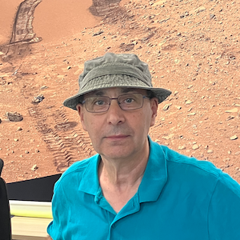

---
# Feel free to add content and custom Front Matter to this file.
# To modify the layout, see https://jekyllrb.com/docs/themes/#overriding-theme-defaults

layout: default
---

  

    
  

  

    Department of Physics  
    University of New Brunswick  
    Research Scientist  
    karim@unb.ca  
  

 

## About Me and My Research

Karim Meziane received his Doctorate in Astrophysics and Space Physics at the University Paul Sabatier. In 1995, he was a
Postdoctoral Fellow at the Centre d'Etude Spatiale des Rayonnements [CESR] (now Instutut de Recherche en Astrophysique & Planétologie, IRAP), Toulouse France. Between 1996 and 2000
he was a visiting scholar at the University of Washington, Seattle and at the Space Sciences Laboratory, Berkeley where he
worked closely with Prof. G. K. Parks and Prof. R. P. Lin, respectively. Since September 2000, he is a Research Scientist
and Lecturer at the University of New-Brunswick. K. Meziane received many grants from Institut National des Sciences de
l'Univers (INSU) for collaborative projects with Cluster-CIS team. He is Co-Investigator on Cluster and Double Star ion
instruments. He also was co-Investigator of an ISSI "International Team" between 2004 and 2006 ("A Collaborative Effort
to Study the Production and Transport of 1-30 keV Upstream Ions").
Karim Meziane gleaned substantial experience working on measurements from spaceborne instrumentation, such as the
ISEE analysers, Wind-3DP experiment and now, the Cluster-CIS experiment. The main focus on his research is on the
mechanisms responsible for the acceleration of ions to energies from few keV to ~ 1MeV at collisionless plasma shocks.
His recent work shed light on the character of the boundaries within the Earth's foreshock, the sources of plasma waves seen
in association with foreshock beams, and the nature of unexpected angular particle distributions seen at very high energies.

## Recent Publications

- Al-Buradah, S., Hamza, A. M., & **Meziane, K.** (2026). The Electromagnetic gradient drift instability: The case of the Martian ionosphere. Journal of Geophysical Research: Space Physics, 131, e2025JA034898. [See Publication](https://doi.org/10.1029/2025JA034898)
- Dr. Luca Spogli, **Dr. Karim Meziane**, Prof. P. T. Jayachandran, et al. Investigating the leptokurtotic nature of low latitude GNSS scintillations with a multiscale approach. ESS Open Archive. 12 April 2026. [See Publication](https://doi.org/10.22541/essoar.15001849/v1)
- Hamza, A. M., & **Meziane, K.** (2025). Radio wave propagation revisited with application to high-latitude ionospheric scintillation. Journal of Geophysical Research: Space Physics, 130, e2025JA034362. [See Publication](https://doi.org/10.1029/2025JA034362)
- **Meziane, K.**, Hamza, A. M., Song, K., & Jayachandran, P. T. (2025). Identifying scales of the ionospheric structure through scintillation events. Journal of Geophysical Research: Space Physics, 130, e2025JA034326. [See Publication](https://doi.org/10.1029/2025JA034326)
- **Meziane, K.**, Mazelle, C. X., Simon-Wedlund, C., Halekas, J. S., Hamza, A. M., Bertucci, C., et al. (2025). Field-aligned proton beams upstream of the Martian bow shock: First observations. Geophysical Research Letters, 52, e2025GL115483. [See Publication](https://doi.org/10.1029/2025GL115483)
- Song, K., **Meziane, K.**, Hamza, A. M., & Jayachandran, P. T. (2025). Investigation of the Fresnel scale from ionospheric scintillation spectra. Journal of Geophysical Research: Space Physics, 130, e2024JA033239. [See Publication](https://doi.org/10.1029/2024JA033239)
- Simon Wedlund, C., Mazelle, C., **Meziane, K.**, Bertucci, C., Volwerk, M., Preisser, L., et al. (2025). Local generation of mirror modes by pickup protons at Mars. Journal of Geophysical Research: Space Physics, 130, e2024JA033275. [See Publication](https://doi.org/10.1029/2024JA033275)

## Other Scientific Interests

- **Meziane, K.** & A. M. Hamza, Crescent-visibility and Hijri-calendar: The limitations of a mediocre erudition, The Muslims500, 2017.
- **Meziane, K.** and N. Guessoum, The Determination of Islamic Fasting and Prayer Times at High-Latitude Locations, Archaeoastronomy, XXII, pp91-111, 2009.
- **Meziane, K.** and N. Guessoum, La Cosmologie Islamique peut-elle être moderne? Etudes Orientales, No 23/24, pp. 145-164, 2005.
- Guessoum, N. and **K. Meziane**, Visibility of the thin lunar crescent: The Sociology of an Astronomical Problem, Journal of Astronomical History and Heritage, 4(1), 1, 2001.
- **Meziane, K.** and N. Guessoum, La Visibilité du Croissant Lunaire et le Ramadan, La Recherche, 316, pp. 66-71, 1999
